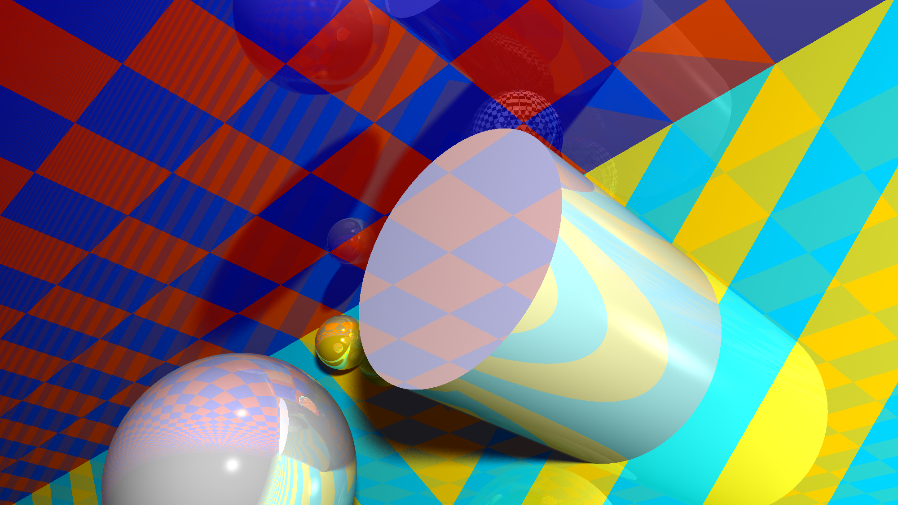
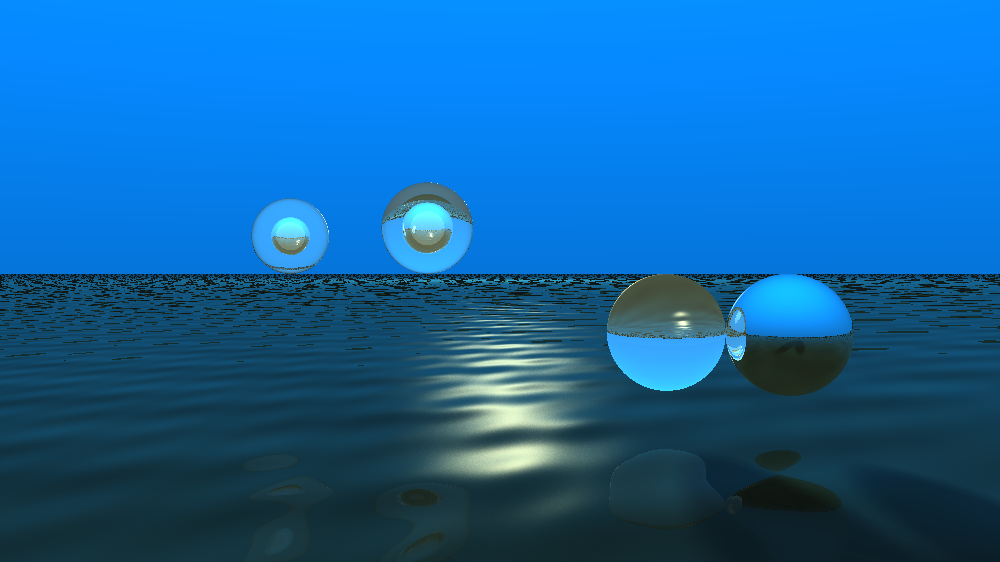
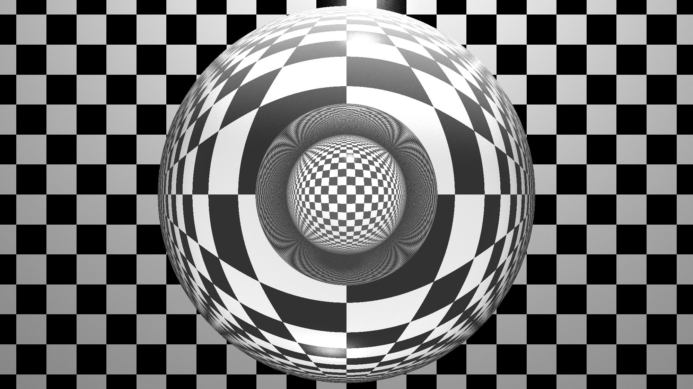
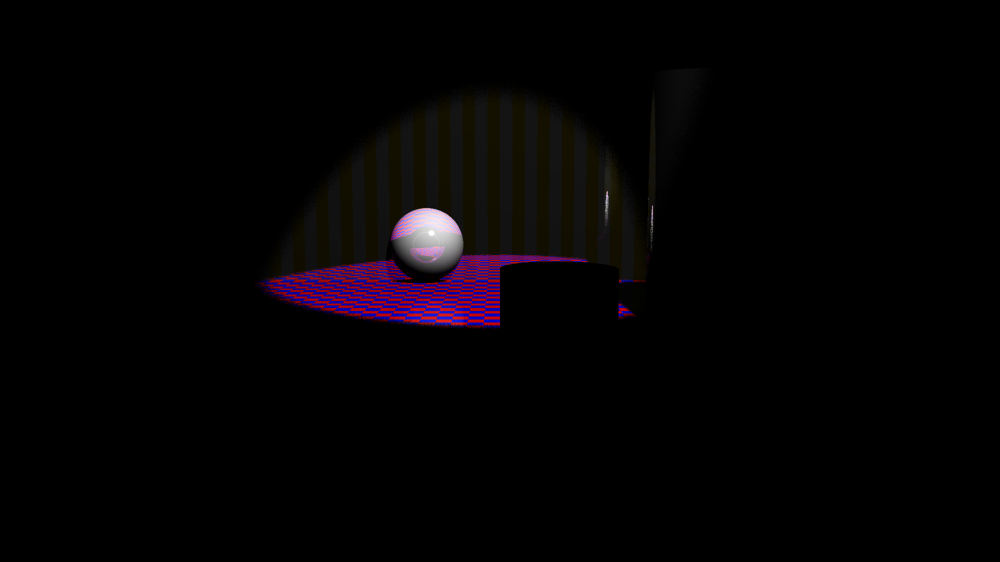
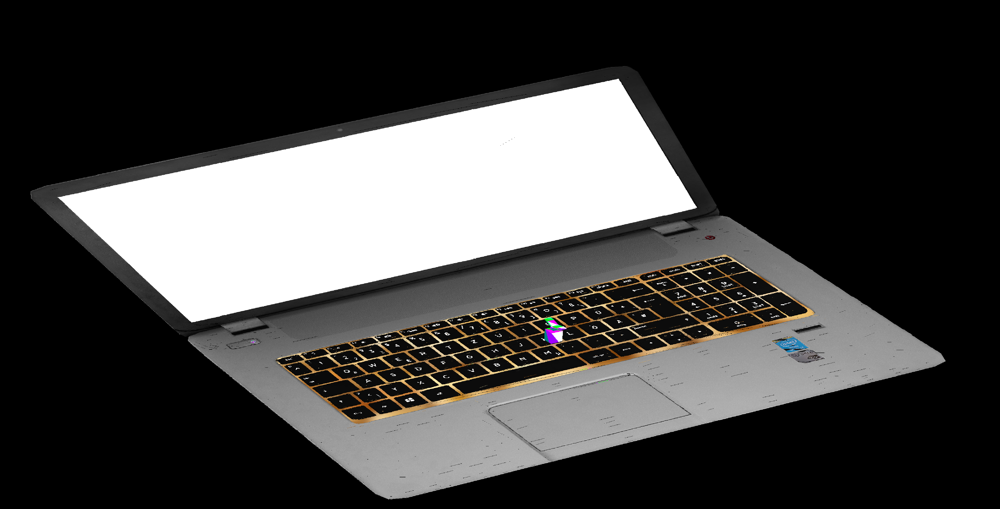
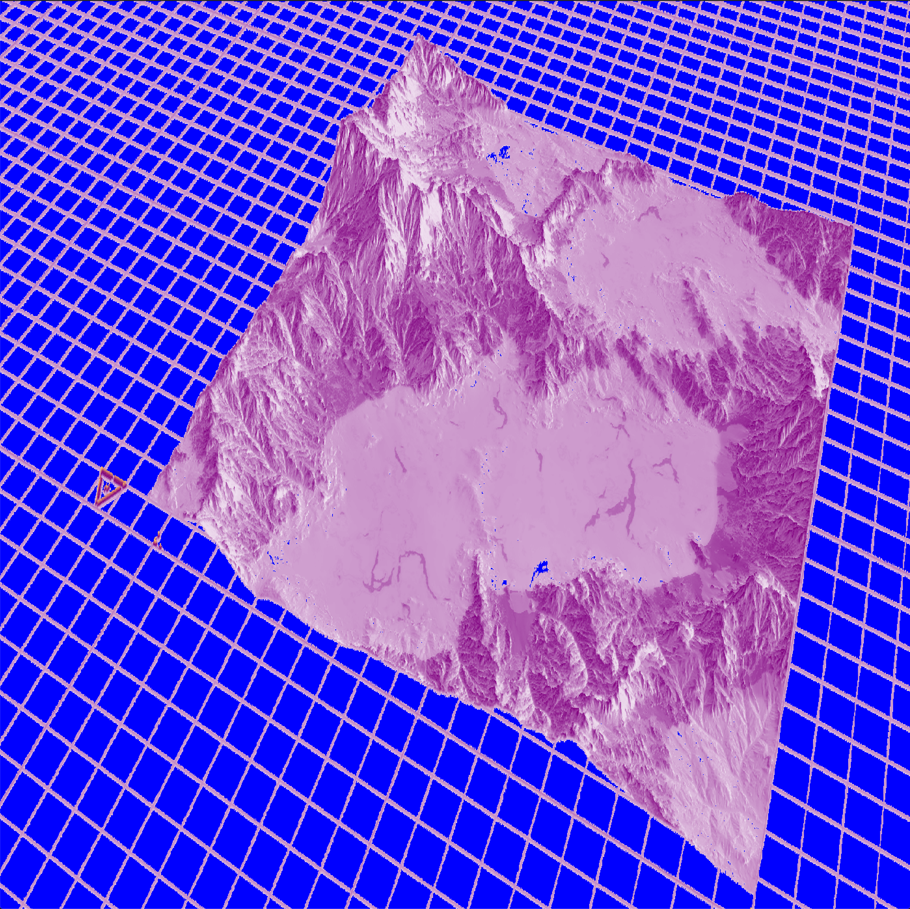
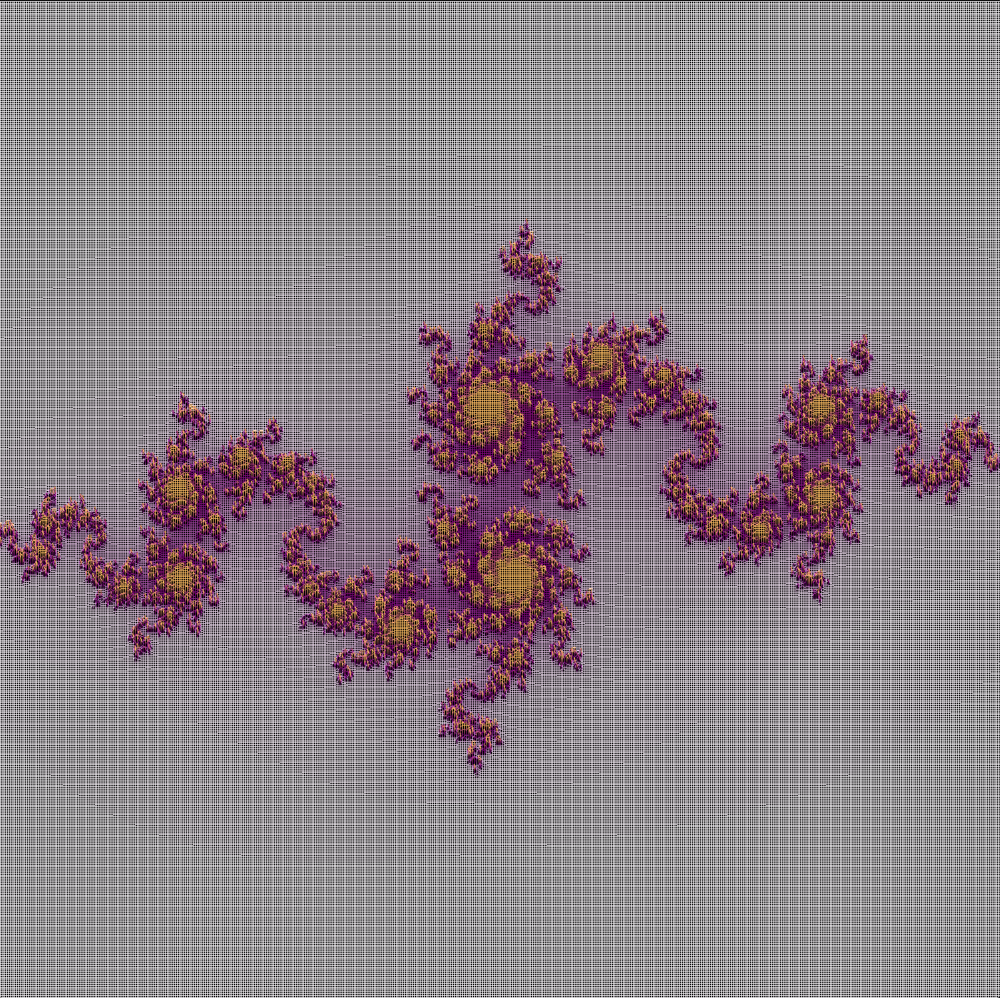
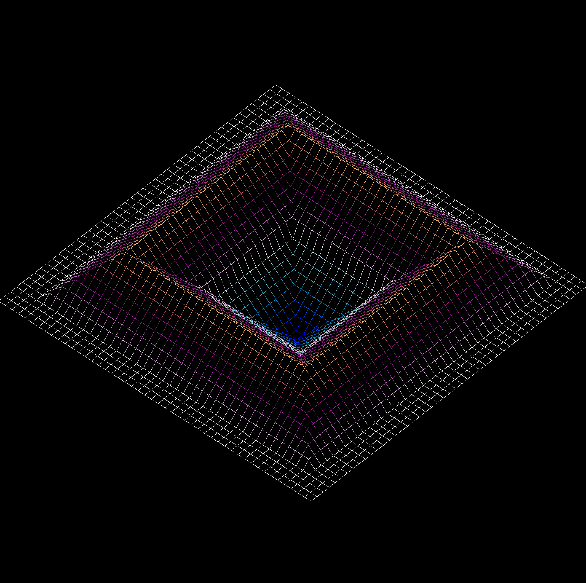
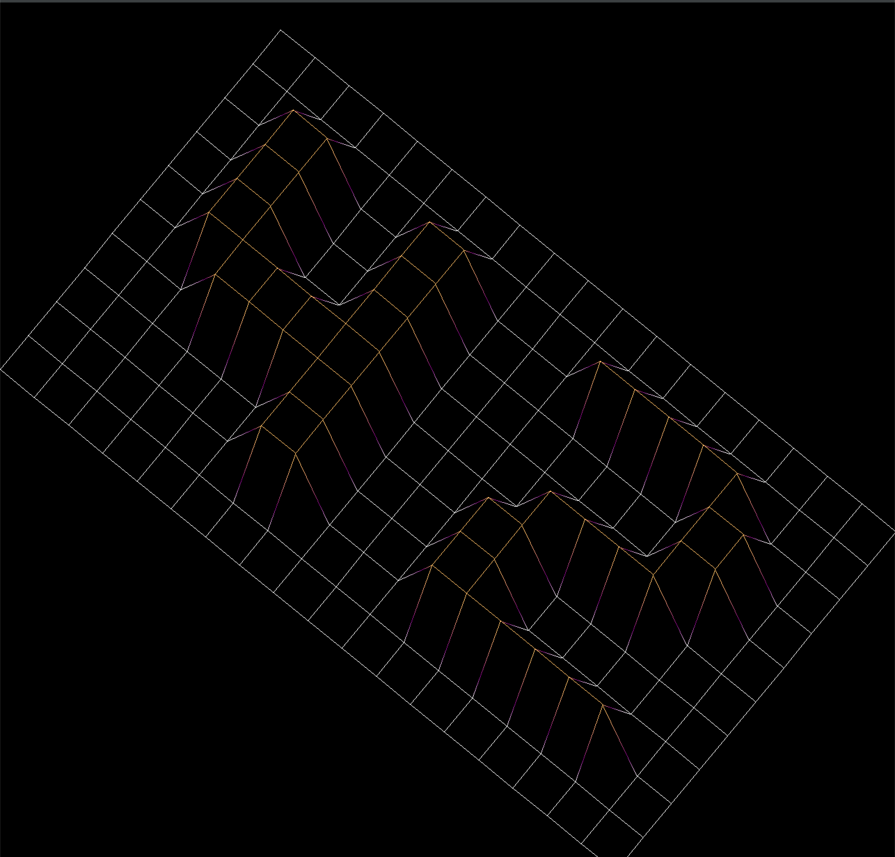

# Graphics Projects Collection

This repository showcases a selection of my personal graphics projects, each reflecting different stages of my journey into 3D graphics and rendering techniques.

---

## 🟢 miniRT: Advanced Raytracing Project

As part of the 42 core curriculum, students choose between miniRT (raytracing) and cub3D (raycasting). After pushing the limits with cub3D, I selected miniRT as my next group project, focusing on realistic rendering. We collaborated intensively to refine the project's complexity and visual quality.

### 🔧 Key Features

- Implementation of the **Phong reflection model** (ambient, diffuse, and specular reflections)
- Optional **soft shadows** for more realistic visuals
- **Transparent surfaces** with accurate **refraction**
- Procedurally generated **"weave" surfaces** using higher-order trigonometric functions
- A variety of **material types** (metal, glass, water)
- **Pixel buffer export** functionality to `.ppm` image files

This project was built entirely from scratch, using only a minimal grapgics library to render pixel buffers directly. Having worked on cub3D, I understood the importance of linear algebra and dedicated significant time to mastering its concepts. That became the most valuable takeaway from miniRT.

---

## 🟡 cub3D: From Simple Raycaster to Full 3D Renderer

Initially part of the 42 curriculum, cub3D was intended to be a basic raycasting game. However, I found raycasting too limiting and began exploring full 3D rendering, significantly expanding the scope.

### 🧪 Enhancements

- Implementation of an **.obj file parser** with support for `.mtl` files and textures
- A full **CPU-based rendering pipeline** with custom projection and triangle rasterization
- Experimentation with **lighting techniques**

Although unfinished and containing known bugs, this project was a critical learning experience and helped solidify my foundation in graphics programming.

---

## 🔵 fdf: Introduction to 3D Graphics

The `fdf` project, another 42 core curriculum assignment, was my introduction to 3D graphics. Originally an isometric wireframe renderer, I extended it into a full 3D wireframe rendering engine.

### ✨ Features

- Dynamic **wireframe rendering**
- **3D camera movement**
- Object loading from a custom file format

